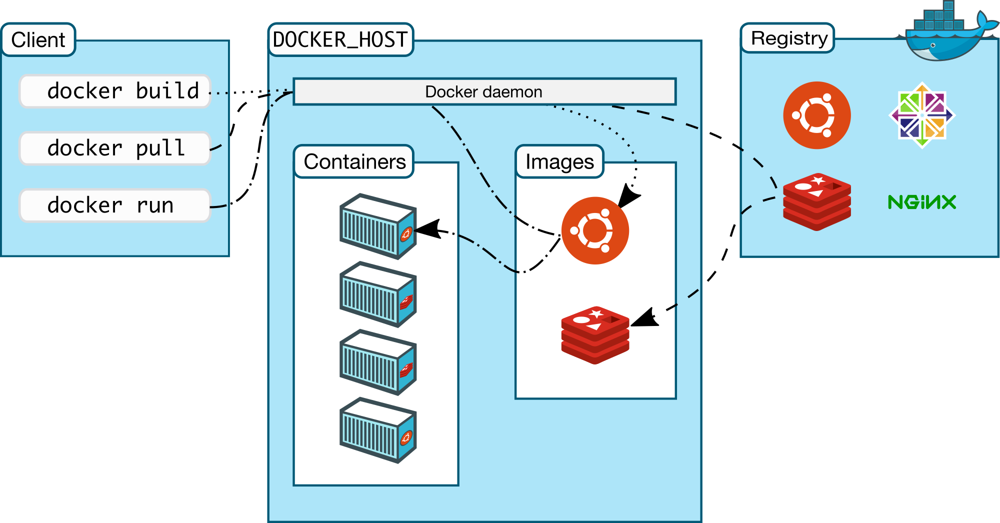

## Introduction

The purpose of this article is to give you a **basic** understanding of Docker, its components, and how it can be used to improve the development and deployment of applications.

Docker is a platform for developing, shipping and running applications. It provides a way to package applications and their dependencies into a lightweight, portable container that can run on any infrastructure. Docker has become increasingly popular in recent years due to its ability to streamline the development process, increase deployment efficiency, and improve collaboration between teams.

## What is Docker?

Docker is a platform that allows us to package, distribute, and run applications in containers. A container is a lightweight, standalone executable package of software that includes everything needed to run an application: code, libraries, system tools, and settings.

The main components of Docker include:

- **Docker Engine**: the core component of Docker that manages containers, images, networks, and volumes.
- **Docker Hub**: a public repository of Docker images that can be used to store and share their images.
- **Docker CLI**: a command-line interface tool used to interact with Docker Engine and manage containers and images.

The benefits of using Docker include:

- **Portability**: Docker containers can run on any infrastructure that supports Docker, regardless of the underlying operating system.
- **Scalability**: Docker allows to quickly spin up new instances of containers to handle increased traffic or demand.
- **Efficiency**: Docker containers are lightweight and efficient, allowing for faster deployment and less resource usage.
- **Consistency**: Docker ensures that the development, testing, and production environments are consistent, reducing the likelihood of errors and bugs.

## Docker Architecture

Docker architecture consists of several components that work together to create and manage containers. Let's take a look at a high-level diagram of Docker architecture:

The main components of Docker architecture include:

- **Docker Client**: A command-line interface or GUI tool that sends commands to the Docker daemon.
- **Docker Daemon**: The core component of Docker that manages Docker objects such as containers, images, volumes, and networks.
- **Docker Registries**: A place where Docker images are stored and shared. [Docker Hub](https://hub.docker.com/) is a public registry, and private registries can also be set up.
- **Docker Images**: A read-only template with instructions for creating a Docker container.
- **Docker Containers**: An isolated and executable package that includes everything needed to run an application.



When a user creates or runs a Docker container, the Docker Client sends a command to the Docker Daemon. The Daemon then communicates with the Docker Registry to download the Docker Image and creates a new Docker Container based on the Image. The Container is then run in its isolated environment, with its filesystem, network, and resources.

Let's talk about some of these architecture components.

## Docker Image

A Docker Image is a lightweight, standalone, executable package that includes everything needed to run an application, including code, libraries, and dependencies. Docker Images are created from Dockerfiles or by manually creating them and can be stored in a Docker Registry such as Docker Hub.

To create a Docker Image, the most common way is to use a Dockerfile, which is a text file that contains a set of instructions to build the image. These instructions include which base image to use, what commands to run to install dependencies, and how to configure the environment.

Here are the different ways to create a Docker Image:

- **Dockerfile**: A text file that contains a set of instructions to build the image.
- **Manual Creation**: can create an image manually by running a container, installing the necessary software and dependencies, and then committing the changes to a new image.
- **Docker Compose**: A tool for defining and running multi-container Docker applications.

Once the Docker Image is created, it can be stored in a Docker Registry and shared with others. By using Docker Images, developers can easily share and distribute their applications and ensure that they run consistently across different environments.

## Docker Container

A Docker Container is a runnable instance of a Docker Image. It provides an isolated environment for an application to run, with its filesystem, network, and resources.

To create a Docker Container, the `docker run` command is used. This command creates a new container based on the specified image and runs the application inside the container. The container can be configured with specific settings such as port mappings, volume mounts, and environment variables.

By using Docker Containers, application can easily be deployed in a consistent and repeatable way, and ensure that they run reliably across different environments. Docker Containers also provide a lightweight and efficient way to run applications, without the overhead of an extra layer of virtualization like a virtual machine.

## Image vs Container

In summary, the main differences between Docker images and Docker containers are:

- Docker images are read-only, immutable templates that define how a container will be realized, while Docker containers are runtime instances of Docker images that get created when the `docker run` command is implemented.
- Docker images can exist without containers, whereas a container needs to run an image to exist. Therefore, containers are dependent on images and use them to construct a runtime environment and run an application.
- Docker images are like blueprints or classes, while Docker containers are like actual instances of the blueprint or class.
- Docker images are immutable, meaning they cannot be changed, while Docker containers can be created, started, stopped, moved, or deleted using the Docker API or CLI.

## Docker Hub

Docker Hub is a central repository for Docker Images that allows developers to easily share and distribute their applications. It provides a secure and scalable way to store and manage Docker Images and includes many public images that can be used as a starting point for any container.

Here are some benefits of using Docker Hub:

- Access to a large library of public images: Docker Hub provides access to many public images, which can be easily searched and downloaded to quickly get started with Docker without having to create images from scratch.
- Easy sharing and collaboration: Docker Hub allows to easily share their images with others, and collaborate on projects with team members.
- Security and scalability: Docker Hub provides a secure and scalable platform for storing and managing Docker Images, ensuring that they are always available and protected.

To search for and download existing Docker Images from Docker Hub, the `docker search` and `docker pull` commands can be used. The `docker search` command allows searching for images based on keywords, while the `docker pull` command allows downloading the images to a local machine.

## Docker Networking

Docker Networking allows containers to communicate with each other, and with the outside world, using a variety of network modes. By default, Docker uses a _bridge_ network mode, which provides a private network for containers to communicate with each other, while also allowing them to access the host machine's network.

Here are the different types of network modes in Docker:

- **bridge**: This is the default network mode in Docker, and it creates a private network for containers to communicate with each other. Each container gets its IP address on the bridge network and can communicate with other containers on the same network.
- **host**: In this mode, the container shares the host machine's network stack, and does not get its IP address. This allows the container to access the host machine's network directly, without any network address translation (NAT).
- **overlay**: This mode allows containers to communicate with each other across multiple Docker hosts, using an overlay network. This is useful for running distributed applications across multiple machines.
- **ipvlan**: This is an advanced driver that offers precise control over the IPv4 and IPv6 addresses assigned to your containers, as well as Layer 2 and 3 VLAN tagging and routing.
  - **L2 mode**: This is the default mode for **ipvlan**. It works similarly to **macvlan** mode but without assigning a unique MAC address to each container. In L2 mode, the Docker host acts like a switch between the parent interface and a virtual NIC for each container.
  - **L3 mode**: In this mode, the Docker host works like a Layer 3 device to route the packets between the parent interface and the virtual NIC for each container. This mode restricts broadcasts to the Layer 2 subnet only, improving network performance. However, you need to manually add a static route on your gateway router to let other network devices know how to reach your `ipvlan` network running in L3 mode.

    In both modes, all containers on a Docker host share a single MAC address. This is different from **macvlan**, which allocates a unique MAC address to every container. Also, unlike **macvlan**, **ipvlan** does not require you to enable promiscuous mode on the parent interface of the Docker host. **ipvlan** is particularly useful when integrating containerized services with an existing physical networks, and it works well in cloud environments like AWS or Azure. **ipvlan** works by associating container interfaces directly to a Linux Ethernet interface or sub-interface, bypassing the traditional Linux bridge used for isolation. This results in a simpler setup and potentially better performance.
- **macvlan**: This mode allows containers to have their own MAC address, and to be connected to the physical network directly. This is useful for running applications that require direct access to the network, such as network monitoring tools.

## Docker Volumes

Docker Volumes are used to persist data between containers, or between a container and the host machine. Volumes are independent of the container's lifecycle and can be easily shared between containers or across multiple Docker hosts.

Here are the two main types of Docker volumes:

- **Anonymous**: This type of volume is created by Docker itself, and does not have a specific name; typically used to store temporary or transient data generated by a container during its lifecycle.
- **Named**: This type of volume is created with a specific name, and can be shared between multiple containers. It's useful for persisting data that needs to be shared across multiple containers or Docker hosts.

## Docker Compose

Docker Compose is a tool that allows to define and manage multi-container Docker applications. It uses a _YAML_ file to define the containers, their dependencies, and their configuration, making it easy to manage complex applications with multiple services.

Here are some features of Docker Compose:

- Automatic container creation: Docker Compose automatically creates and starts containers for all the services defined in the _YAML_ file.
- Service dependencies: Docker Compose allows defining dependencies between services, ensuring that they start in the correct order.
- Environment variables and configuration files: Docker Compose allows setting environment variables and configuration files for each service, making it easy to configure and customize each service.

Here's an example of a simple Docker Compose file:

```shell
version: '3'
services:
  web:
    image: nginx
    ports:
      - "80:80"
  db:
    image: mysql
    environment:
      MYSQL_ROOT_PASSWORD: example
```

In this example, we define two services: "web" and "db". The web service uses the "nginx" image and maps port 80 on the container to port 80 on the host machine. The "db" service uses the "mysql" image and sets the "MYSQL_ROOT_PASSWORD" environment variable.

By using Docker Compose, complex multi-container applications can be managed and deployed using a structured and readable configuration file.

## Conclusion

In this article, I've covered the basics of Docker, including its architecture, images, containers, networking, volumes, Docker Hub, and Docker Compose.

I encourage everyone to try Docker for themselves, as it can greatly simplify the development and deployment of applications. Docker is widely used in the industry, with many resources available for learning.

To learn more about Docker, I recommend checking out the official Docker documentation at [docs.docker.com](https://docs.docker.com), as well as online courses and tutorials. With Docker, the possibilities are endless, and I hope this article has given you a good introduction to this powerful tool.
