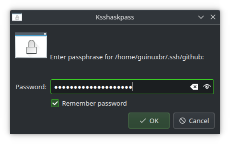

This quick tip was tested on openSUSE Tumbleweed. However, it will probably work for other Linux distributions running KDE Plasma.

## Install ksshaskpass5

Using Zypper, install `ksshaskpass5`

```bash
sudo zypper in --details ksshaskpass5
```

## Create the configuration files

Create the `.desktop` file that will be automatically parsed at KDE Plasma start-up. Add all the needed keys using `ssh-add -q`. The "q" here stands for quiet.

```shell
vim ~/.config/autostart/ssh-add.desktop
```

```bash
[Desktop Entry]
Exec=ssh-add -q /home/user_name/.ssh/key1 /home/user_name/.ssh/key2 < /dev/null
Icon=dialog-scripts
Name=ssh-add.sh
Type=Application
X-KDE-AutostartScript=true
```

For the `Exec` command, I've used the `/home/user_name/` path because `~` or `$HOME` did not work as expected.

Create another script in `~/.config/plasma-workspace/env/` to set the environment variable `SSH_ASKPASS` to use **ksshaskpass**.

```bash
vim ~/.config/plasma-workspace/env/ksshaskpass.sh
```

```bash
#!/bin/sh
export SSH_ASKPASS='/usr/libexec/ssh/ksshaskpass'
```

## Reboot to test

Now reboot the machine. In the next login, a dialogue window asking for your SSH key password will appear for each added key.  
Ensure to mark the option "Remember password".  


