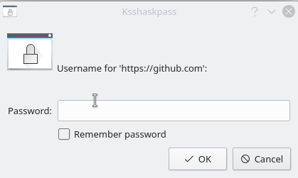

## Introduction

Hi and welcome to my blog!

KWallet is a KDE Plasma tool to store any credentials and secrets safely. It has an interface called KWallet Manager that allows one to manage credentials and secrets easily.

In this quick tutorial, I'll show how to configure your KDE to store your GitHub credentials in KWallet. This guide was tested against [openSUSE Tumbleweed](https://www.opensuse.org/) but should work for most Linux distributions.

First, make sure to have `ksshaskpass` installed. `ksshaskpass` is an ssh-add helper that uses `kwallet` and `kpassworddialog` to show a window where you should type your credentials.

## Create the needed files

Now, create an autostart script file and mark it as executable:

```shell
vim ~/.config/plasma-workspace/env/askpass.sh
```

Put the following content in the file:

```shell
#!/bin/sh
export GIT_ASKPASS='/usr/lib/ssh/ksshaskpass'
```

Save and exit. Now make it executable.

```shell
chmod +x ~/.config/plasma-workspace/env/askpass.sh
```

## Conclusion

Next time you log in, open Konsole and try to clone some of your private GitHub repositories.
If your wallet is already open and you will see the `ksshaskpass` dialogue asking for your username and then asking for your password. Ensure to mark "Remember password" to save your credentials safely in your wallet.


